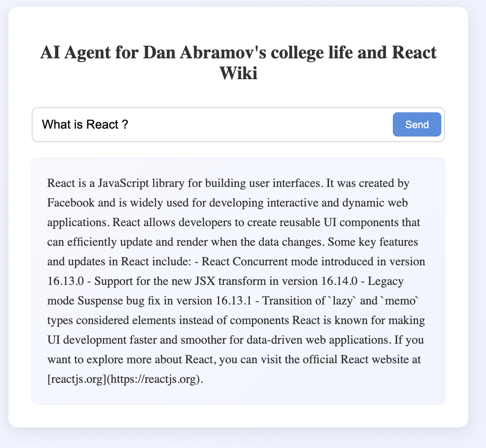
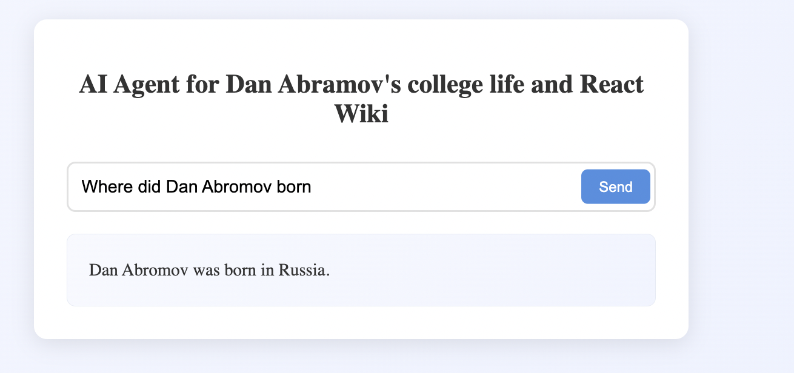
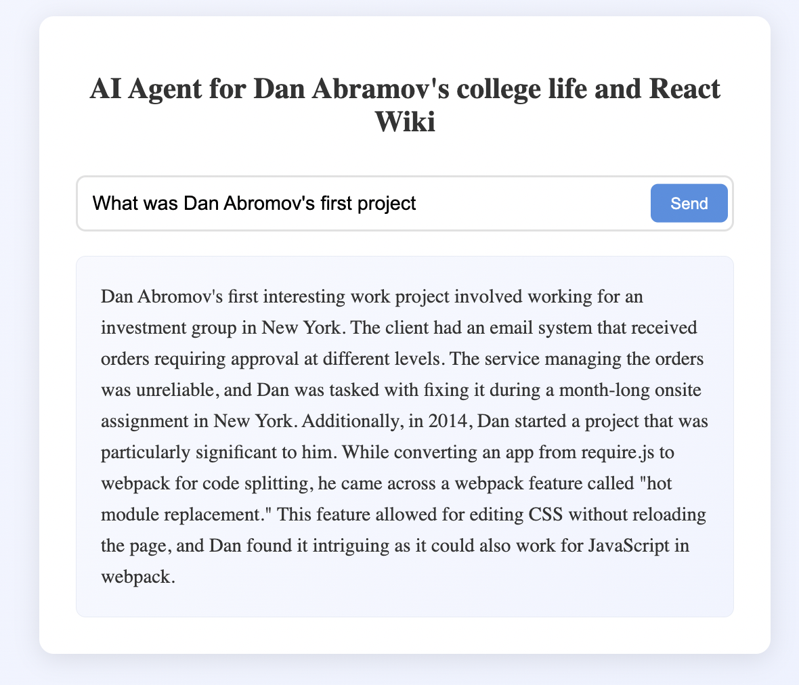
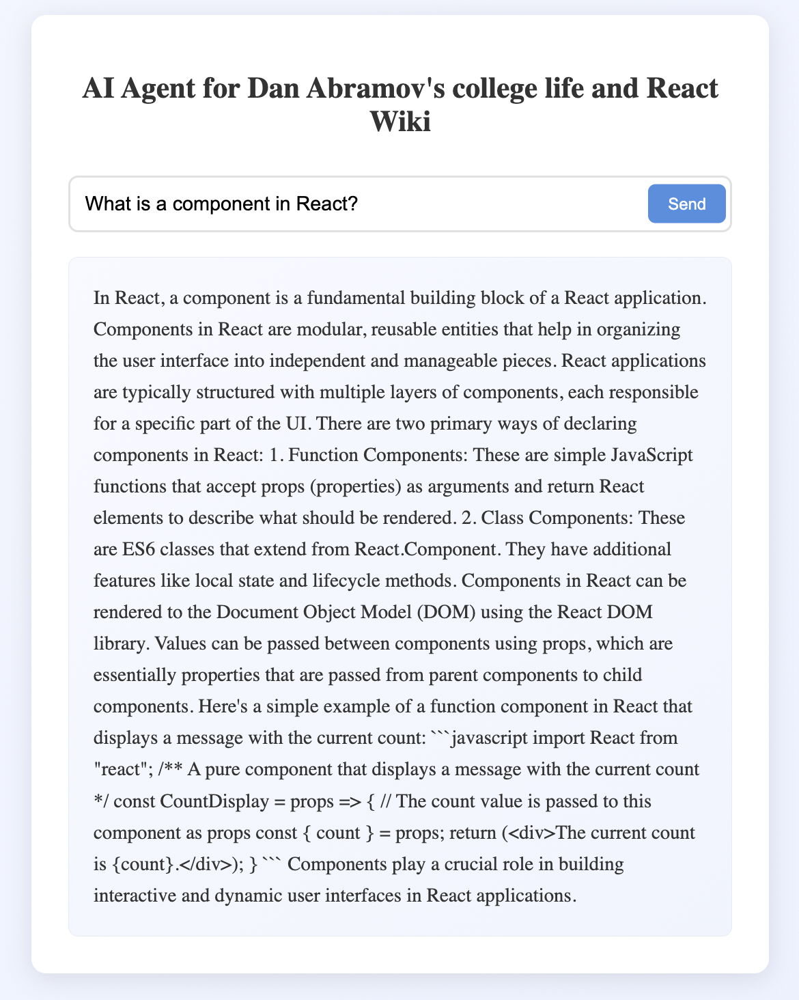
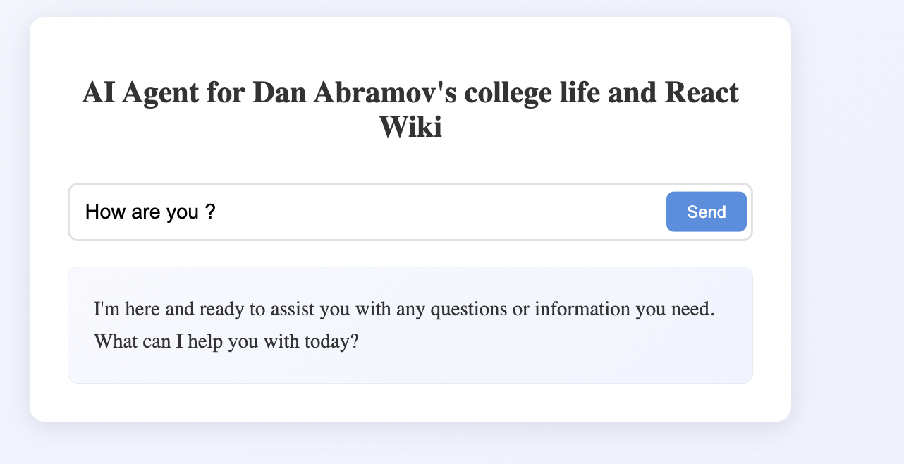
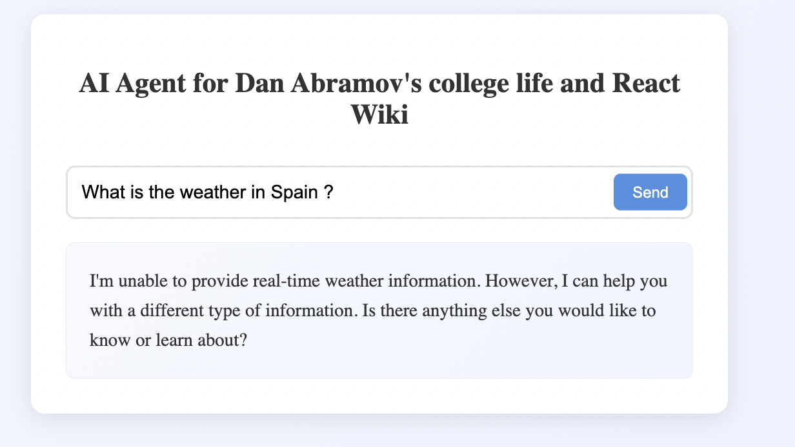

# Full Stack RAG Agent - Dan Abramov Essays & React Wiki Explorer

A full-stack application that implements a Retrieval-Augmented Generation (RAG) system using LangChain and ChromaDB. The system processes and provides intelligent responses from two distinct datasets: Dan Abramov's college essays and React documentation wiki.


## Tech Stack

### Backend

* Node.js & Express
* LangChain.js
* ChromaDB
* OpenAI API

### Frontend

* React (Vite)
* TailwindCSS


## Setup Instructions
* Clone the repo
```bash
git clone https://github.com/grep-vibhor/full-stack-rag-agent-app.git
cd full-stack-rag-agent-app
```

### Backend Setup
1. Install dependencies:
```bash
cd backend
npm install
```

2. Create env vars:

```bash
export OPENAI_API_KEY=sk-proj..... 
```
3. Run Vector Store Database

```bash
	docker pull chromadb/chroma
	docker run -p 8000:8000 chromadb/chroma  
	curl http://localhost:8000/api/v1/heartbeat
```

4. Have a quick look at input data files

```bash
cat backend/data/abromov.txt
cat backend/data/react_wiki.txt
```
* Data1 - Essay written by Dan Abramov (react founder) of what he did in college
* Data2 - React WIKI

5. Initialize the vector store:

```bash
node input_chain.js
```


6. `output_chain.js` is a simple chain using langhchain to test input chain 

7. Then we have `rag_agent.js` to get output from agent

8. Start the server:
```bash
node server.js
```

9. You can check API call via Postman  
```bash
curl -XPOST  http://localhost:3000/query -d "{'query': 'What is react?'}"
```

### Frontend Setup

1. Install dependencies:
```bash
cd frontend
npm install
```

2. Start the development server:
```bash
  npm run dev
```

3. Chat with interface reagrding input data 








## Backend Implementation

1. Data Processing and Embeddings

```javascript
// backend/input_chain.js
import { RecursiveCharacterTextSplitter } from 'langchain/text_splitter';

export const processText = async (text) => {
  const splitter = new RecursiveCharacterTextSplitter({
    chunkSize: 1000,
    chunkOverlap: 200
  });
  return await splitter.createDocuments([text]);
};
```


2. Vector Store Setup

```javascript
// backend/input_chain.js
import { Chroma } from 'langchain/vectorstores/chroma';
import { OpenAIEmbeddings } from 'langchain/embeddings/openai';

export const initializeVectorStore = async (documents, collectionName) => {
  return await Chroma.fromDocuments(
    documents,
    new OpenAIEmbeddings(),
    {
      collectionName,
    }
  );
};
```

3. Agent Setup

```javascript
// backend/rag-agent.js
const tools = [abromovTool, reactTool]

const agent = await createOpenAIToolsAgent({
    llm,
    tools,
    prompt,
  });

const agentExecutor = new AgentExecutor({
    agent,
    tools,
  });
```


4. Express Server

```javascript
// backend/server.js
import express from 'express';
import cors from 'cors';
import { agent } from './agent.js';

const app = express();
app.use(cors());
app.use(express.json());

app.post('/query', async (req, res) => {
  try {
    const { query } = req.body;
    const response = await agent.call({ input: query });
    res.json({ response: response.output });
  } catch (error) {
    res.status(500).json({ error: error.message });
  }
});

app.listen(3000, () => console.log('Server running on port 3000'));
```


## Frontend Implementation

1. Chat Interface Component
```javascript
// frontend/src/components/QuerySender.jsx
const QuerySender = () => {

    useEffect(() => {
        const fetchResponse = async () => {
            if (!isSubmitted) return;

            setIsLoading(true);
            setError(null);

            try {
                const response = await fetch('http://localhost:3000/query', {
                    method: 'POST',
                    headers: {
                        'Content-Type': 'application/json',
                    },
                    body: JSON.stringify({ query }),
                });

                if (!response.ok) {
                    throw new Error(`HTTP error! status: ${response.status}`);
                }

                const data = await response.json();
                setAnswer(data.response);
            } catch (err) {
                setError(err instanceof Error ? err.message : 'An error occurred');
                setAnswer('');
            } finally {
                setIsLoading(false);
                setIsSubmitted(false);
            }
        };

        fetchResponse();
    }, [query, isSubmitted]);

    const handleSubmit = (e) => {
        e.preventDefault();
        if (!query.trim()) return;
        setIsSubmitted(true);
    };

    const handleChange = (e) => {
        setQuery(e.target.value);
    };

    return (
        <div className="query-container">
            <div className="query-card">
                <h1>AI Agent for Dan Abramov's college life and React Wiki</h1>

                <form onSubmit={handleSubmit}>
                    <div className="input-group">
                        <input
                            id="query"
                            type="text"
                            value={query}
                            onChange={handleChange}
                            placeholder="What would you like to know?"
                            disabled={isLoading}
                        />
                        <button
                            type="submit"
                            disabled={isLoading || !query.trim()}
                        >
                            {isLoading ? 'Processing...' : 'Send'}
                        </button>
                    </div>
                </form>

                {error && (
                    <div className="error-message">
                        Error: {error}
                    </div>
                )}

                {isLoading && (
                    <div className="loading-container">
                        <div className="spinner"></div>
                        <span>Thinking...</span>
                    </div>
                )}

                {answer && (
                    <div className="answer-container">
                        <div id="answer">
                            {answer}
                        </div>
                    </div>
                )}
            </div>
            <style >{query_sender_style}</style>
        </div>
    );
};

export default QuerySender;
```


